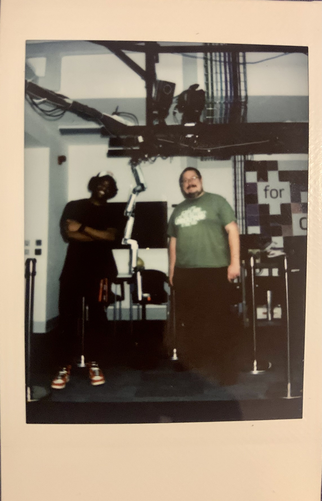
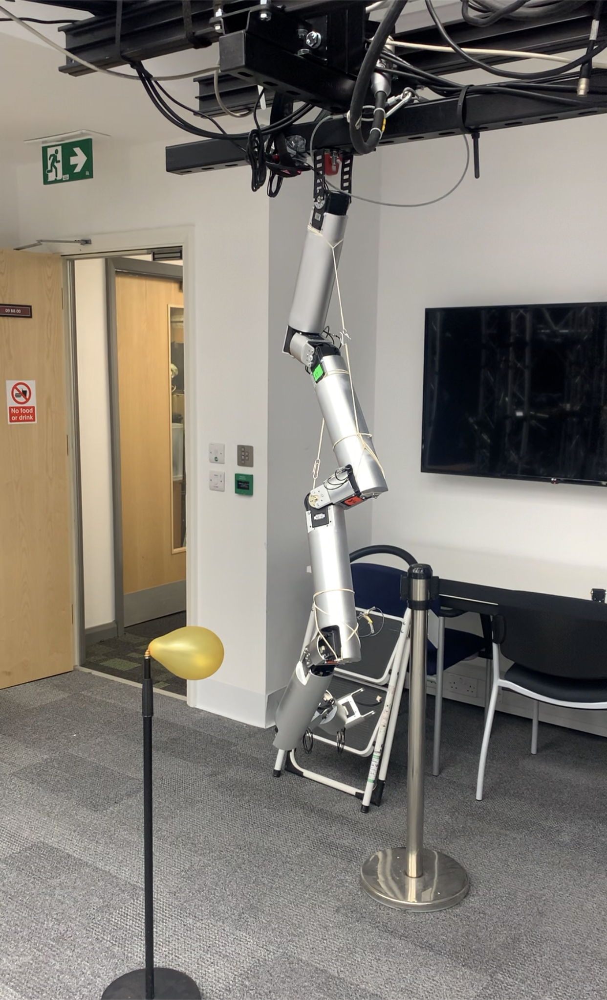
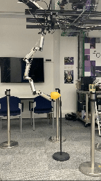

# Tentacle Robotic Arm for Space Exploration and Asteroid Mining

Author: Tega Orogun

Institution: University of Surrey

Degree: Master of Science in Computer Vision, Robotics, and Machine Learning

Supervisor: Dr. Simon Hadfield

# Project Overview 

This repository contains the code, documentation, and design files for the Tentacle Robotic Arm, a flexible robotic manipulator designed for space exploration and asteroid mining applications. The robot is inspired by biological appendages such as octopus tentacles and is developed to navigate and manipulate objects in dynamic, unstructured environments. The primary goal is to build a robotic arm capable of interacting with irregular surfaces like asteroids and performing complex tasks such as resource extraction.

The project explores the robot’s assembly, control systems, and evaluation in different test cases, demonstrating its capabilities for space applications. Future work involves incorporating advanced sensors and machine learning algorithms for autonomous operation in space.

Read the full report here: [Project Dissertation/Report](Masters_Report.pdf)

# Features 

- Flexible Robotic Manipulation: The robot can perform precise, flexible movements, including forming complex shapes (e.g., coiling around objects) and interacting with dynamic targets.
- Custom Control System: Developed using ROS (Robot Operating System), Python, and Dynamixel SDK, allowing manual and semi-automated control.
- Hardware: Utilizes Dynamixel MX-64 motors for high torque and precision, with a focus on achieving smooth, continuous movements.
- Testing and Evaluation: The project includes object interaction and coil formation tests to demonstrate agility and flexibility.
- Potential Applications: Suitable for tasks like asteroid mining, space exploration, and possibly other unstructured environments such as deep-sea exploration.

# Media

## Images

## Videos

A link to a playlist of videos can be found here: https://www.youtube.com/playlist?list=PLdb2QF2oqoR2U0-6Y44sVXupoAS4qNoxw

